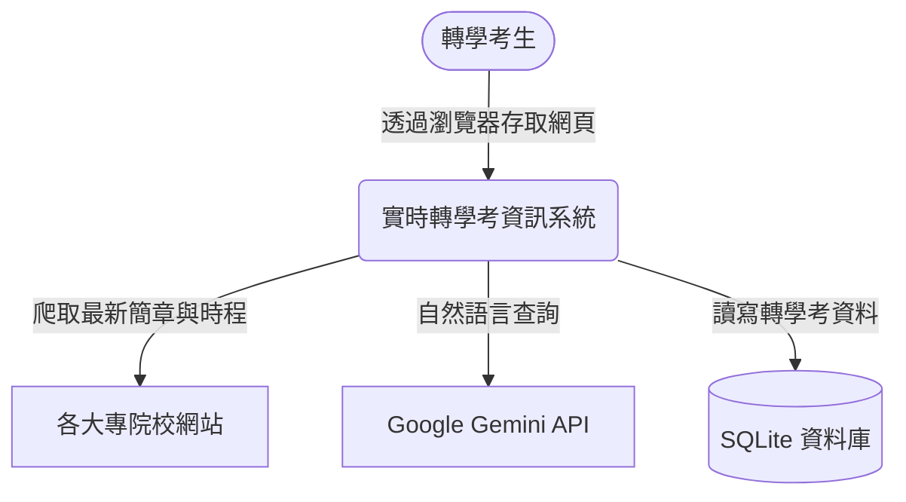

# 系統架構設計 (ARCHITECTURE.md)

## 1. 系統脈絡圖 (System Context)
本系統主要作為轉學考生獲取資訊的聚合平台，並整合了自動化爬蟲與 Google Gemini LLM 來提供進階的問答服務。



## 2. 系統元件設計 (Component Architecture)
為確保系統的可維護性與擴充性，將系統拆分為前端、API 路由、核心服務（資料查詢、爬蟲、AI問答）與資料庫。

```mermaid
graph LR
    subgraph Frontend [前端 (HTML/JS/CSS)]
        UI[搜尋介面與資訊卡片]
        ChatUI[AI 對話視窗]
    end

    subgraph Backend [後端 (FastAPI)]
        API[RESTful API 路由器]
        QueryService[資料查詢服務]
        AIService[AI 問答服務]
        CrawlerService[排程爬蟲服務]
    end

    subgraph Storage [資料儲存]
        DB[(SQLite)]
    end
    
    subgraph External [外部服務]
        TargetWeb[學校教務處網站]
        GeminiAPI[Gemini LLM]
    end

    UI <-->|HTTP/JSON| API
    ChatUI <-->|HTTP/JSON或WebSocket| API
    
    API --> QueryService
    API --> AIService
    
    QueryService <--> DB
    CrawlerService -->|寫入最新簡章| DB
    CrawlerService -->|HTTP GET| TargetWeb
    
    AIService -->|讀取考試資料| DB
    AIService <-->|傳送Prompt/接收回答| GeminiAPI
```

### 元件說明
1. **Frontend (前端)**: 
   - 提供直覺的搜尋框，讓使用者輸入學校或科系，並以卡片或表格形式展示查詢結果。
   - 提供一個對話視窗 (ChatUI)，讓使用者能直接向 AI 提出轉學考相關的複雜問題。
2. **API (FastAPI)**: 
   - 負責接收前端的請求（例如 `/api/search?keyword=台大` 或 `/api/chat`），並導向對應的後端服務處理。
3. **QueryService (查詢服務)**: 
   - 負責與 SQLite 互動，將資料庫中的轉學考資訊（簡章連結、報名時程、限制等）轉換為 JSON 格式回傳。
4. **CrawlerService (爬蟲服務)**: 
   - 系統的核心資料來源。可透過排程工具 (如 APScheduler) 定期向目標學校網站發出請求，解析最新公告並更新到資料庫中。
5. **AIService (AI 問答服務)**: 
   - 處理使用者的自然語言輸入。
   - 運作邏輯（RAG 概念）：先根據使用者的問題，從資料庫中撈取相關的轉學考資訊，然後將這些資訊與使用者的問題一起打包成 Prompt 傳送給 **Google Gemini API**，讓 Gemini 根據最新資料產出精確、具體的回應。

## 3. 技術堆疊 (Tech Stack)
- **前端 (Frontend)**: 
  - HTML5, CSS3 (可搭配 Bootstrap 或 TailwindCSS 進行快速排版)
  - Vanilla JavaScript (負責 API 呼叫與動態渲染畫面)
- **後端 (Backend)**: 
  - **框架**: Python 3.10+ 與 FastAPI (高效能、自帶 API 文件)
  - **伺服器**: Uvicorn
- **資料庫 (Database)**: 
  - SQLite (輕量級，適合初期專案與展示)
  - ORM 或原生 SQL 操作套件
- **爬蟲技術 (Web Scraping)**: 
  - `requests` + `BeautifulSoup4` (針對傳統靜態網頁)
  - 視情況可加入 `Playwright` (若需爬取動態渲染的教務處網站)
- **AI 整合 (AI Integration)**: 
  - `google-generativeai` 套件，串接 Google Gemini API
- **排程管理 (Task Scheduling)**: 
  - `APScheduler` (用於設定定期更新爬蟲資料的任務)

## 4. 預期目錄結構 (Directory Structure)
```text
Transfer_exam_information/
├── docs/
│   ├── PRD.md
│   └── ARCHITECTURE.md
├── crawler/
│   ├── __init__.py
│   └── scraper.py       # 爬蟲主程式與解析邏輯
├── models/
│   ├── __init__.py
│   └── database.py      # 資料庫連線與資料模型定義
├── routers/
│   ├── __init__.py
│   ├── search.py        # 負責轉學考資訊查詢的 API
│   └── chat.py          # 負責 Gemini AI 問答的 API
├── templates/
│   └── index.html       # 網站首頁與 AI 聊天介面
├── static/
│   ├── style.css        # 前端樣式
│   └── script.js        # 前端互動腳本
├── app.py               # FastAPI 主程式 (啟動點)
└── requirements.txt     # 相依套件清單
```
