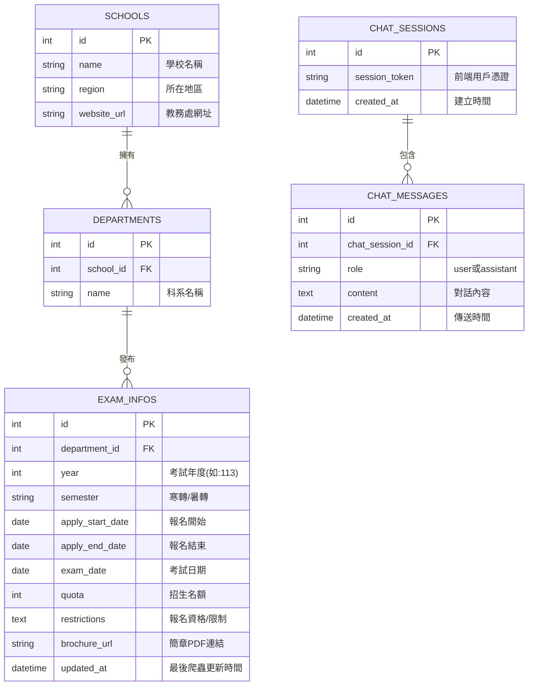

# 資料模型設計 (MODELS.md)

根據產品需求 (PRD) 與系統架構設計 (ARCHITECTURE)，本系統「實時轉學考資訊系統」主要使用 **SQLite** 關聯式資料庫。
資料模型涵蓋了**轉學考資訊儲存**（爬蟲資料）以及 **AI 對話紀錄儲存** 兩大模組。

## 1. 實體關聯圖 (ER Diagram)

以下是系統核心資料表的實體關聯圖，展示了學校、科系、考試資訊以及聊天紀錄之間的關係：

---

## 2. 資料表詳細規格 (Table Specifications)

### 2.1 學校表 (`schools`)
儲存大專院校的基本資料。
| 欄位名稱 | 資料型態 | 屬性 | 說明 |
| --- | --- | --- | --- |
| `id` | Integer | PK, Auto Increment | 學校唯一識別碼 |
| `name` | String(100) | Not Null, Unique | 學校名稱 (例：國立台灣大學) |
| `region` | String(50) | Nullable | 所在地區 (例：北區、中區) |
| `website_url` | String(255) | Nullable | 教務處招生官網網址 |

### 2.2 科系表 (`departments`)
儲存各學校底下的科系資訊。
| 欄位名稱 | 資料型態 | 屬性 | 說明 |
| --- | --- | --- | --- |
| `id` | Integer | PK, Auto Increment | 科系唯一識別碼 |
| `school_id` | Integer | FK | 關聯到 `schools(id)` |
| `name` | String(100) | Not Null | 科系名稱 (例：資訊工程學系) |

### 2.3 轉學考資訊表 (`exam_infos`)
核心資料表，儲存由爬蟲抓取回來的具體轉學考簡章時程與資格。
| 欄位名稱 | 資料型態 | 屬性 | 說明 |
| --- | --- | --- | --- |
| `id` | Integer | PK, Auto Increment | 資訊唯一識別碼 |
| `department_id` | Integer | FK | 關聯到 `departments(id)` |
| `year` | Integer | Not Null | 考試年度 (例：113) |
| `semester` | String(20) | Not Null | 考試季別 (例：暑轉、寒轉) |
| `apply_start_date`| Date | Nullable | 報名開始日期 |
| `apply_end_date` | Date | Nullable | 報名結束日期 |
| `exam_date` | Date | Nullable | 考試日期 |
| `quota` | Integer | Nullable | 招生名額 |
| `restrictions` | Text | Nullable | 報名資格與特殊限制描述 |
| `brochure_url` | String(500) | Nullable | 官方簡章(通常為PDF)下載連結 |
| `updated_at` | DateTime | Not Null | 紀錄最後一次爬蟲更新此筆資料的時間 |

*(註：為了支援 Gemini RAG 問答，這張表的內容會作為 Context 餵給 AI 模型。)*

### 2.4 聊天階段表 (`chat_sessions`)
用來管理使用者的聊天對話群組（若無實作會員登入，可用 Session Token 或 Cookie 辨識）。
| 欄位名稱 | 資料型態 | 屬性 | 說明 |
| --- | --- | --- | --- |
| `id` | Integer | PK, Auto Increment | 對話群組識別碼 |
| `session_token` | String(100) | Not Null, Unique | 前端產生的 UUID 用戶憑證 |
| `created_at` | DateTime | Default(Now) | 聊天室建立時間 |

### 2.5 聊天訊息表 (`chat_messages`)
儲存詳細的 AI 多輪對話歷史紀錄，維持 Gemini 的上下文記憶。
| 欄位名稱 | 資料型態 | 屬性 | 說明 |
| --- | --- | --- | --- |
| `id` | Integer | PK, Auto Increment | 訊息識別碼 |
| `chat_session_id` | Integer | FK | 關聯到 `chat_sessions(id)` |
| `role` | String(20) | Not Null | 訊息發送者，值為 `user` 或 `assistant` |
| `content` | Text | Not Null | 訊息詳細內容 |
| `created_at` | DateTime | Default(Now) | 訊息發生時間 |
